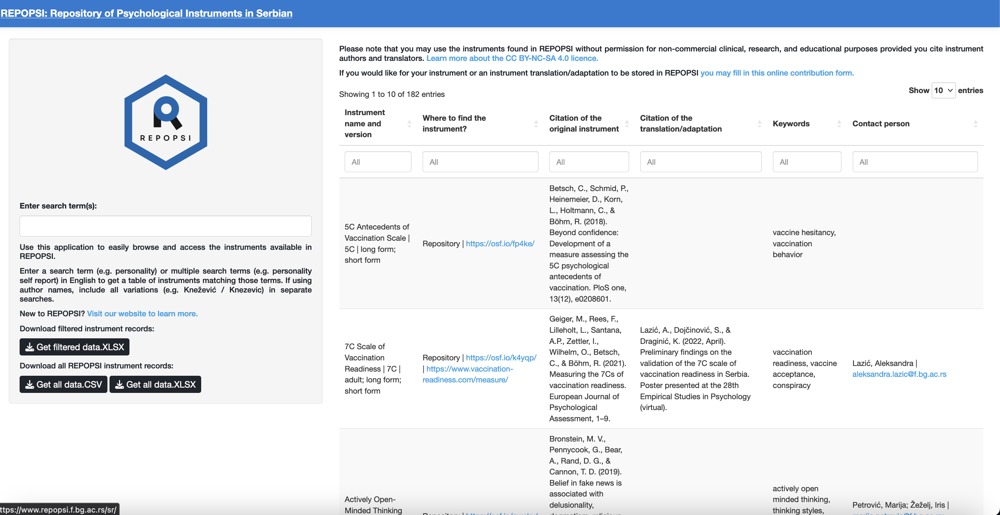
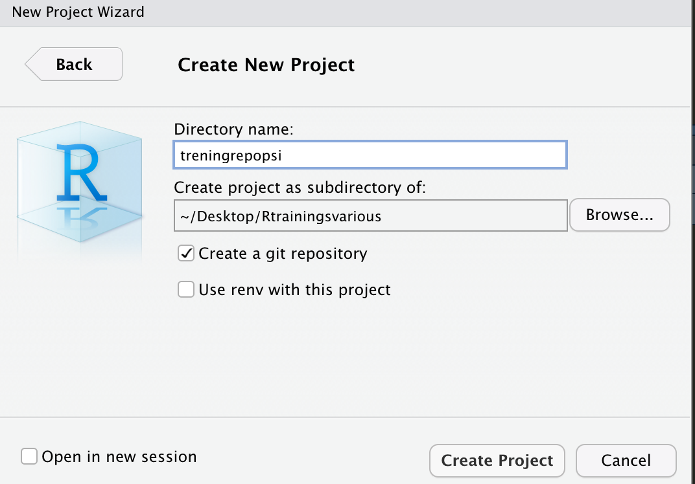
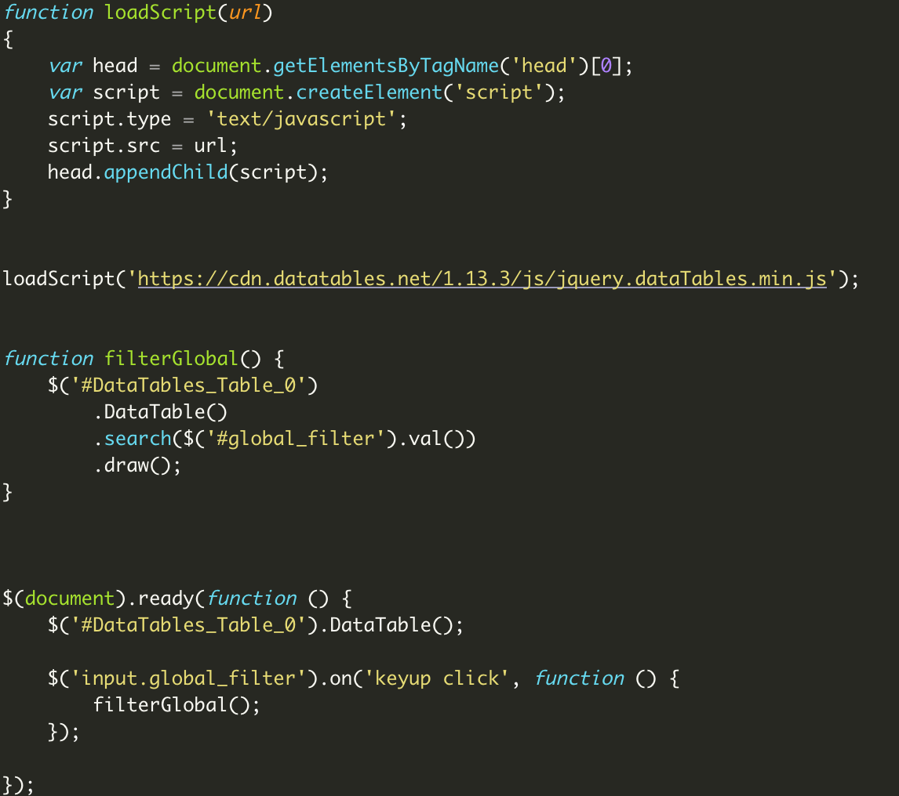
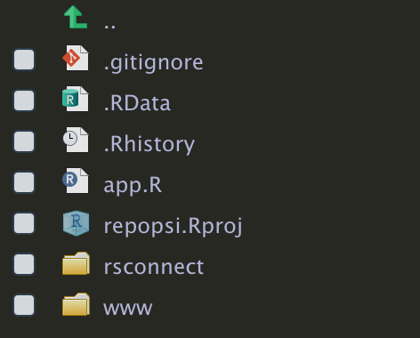
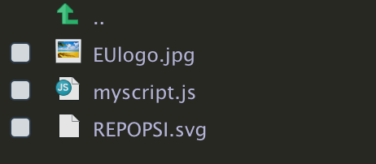
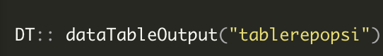
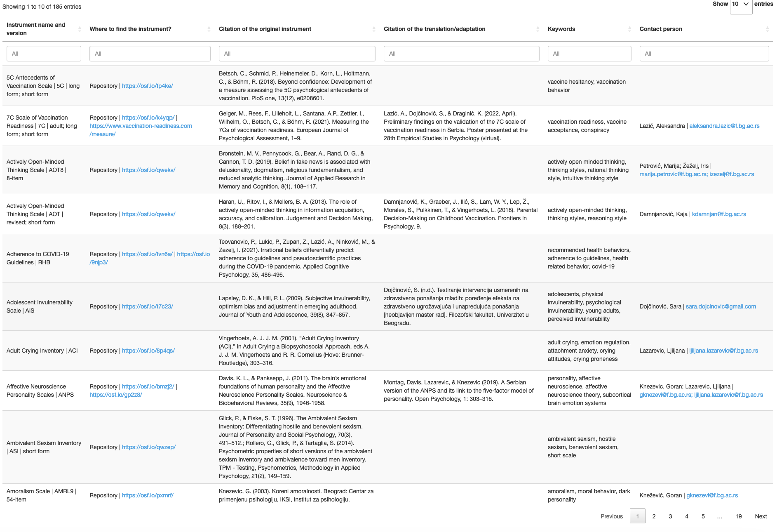
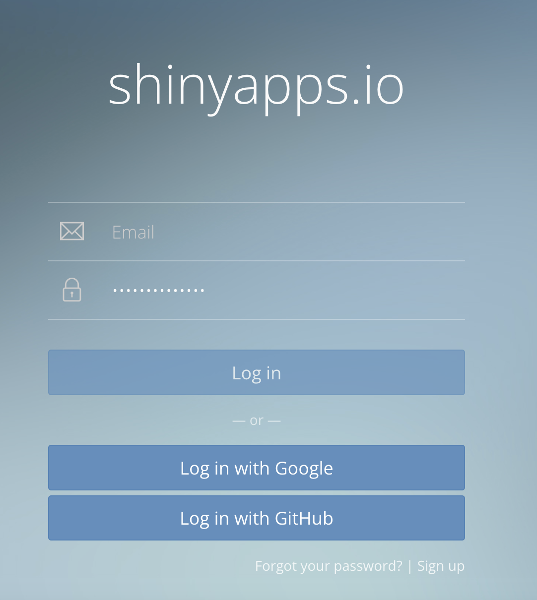
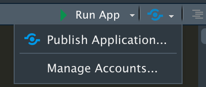
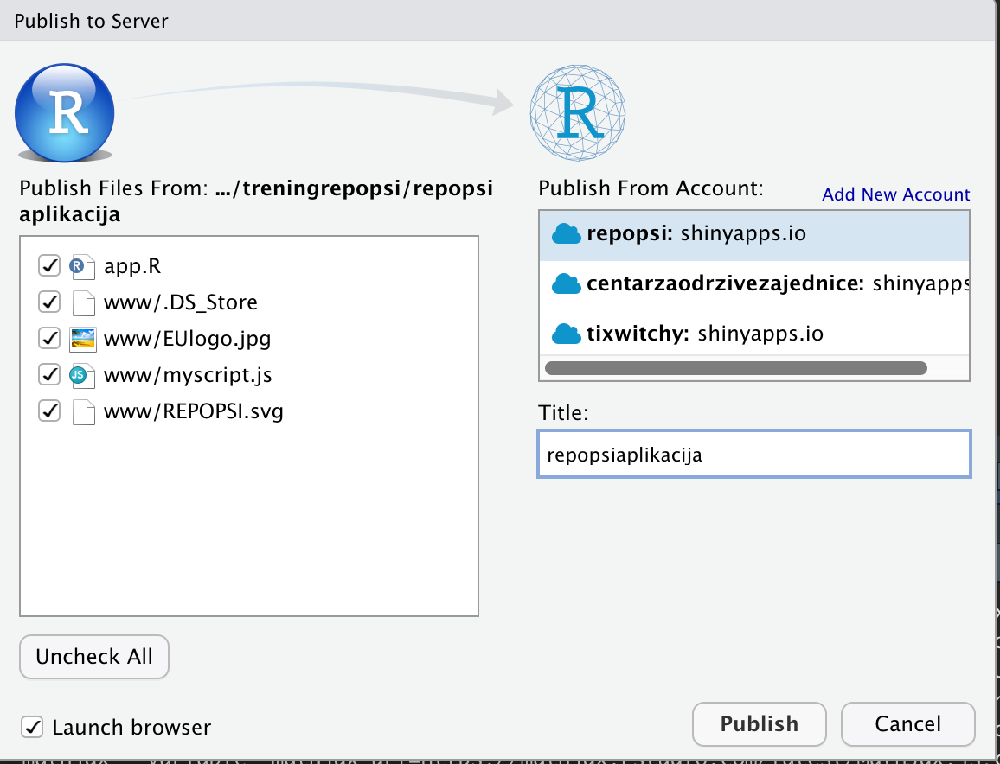

---
title:
output: 
  revealjs::revealjs_presentation:
          theme: sky
          highlight: kate
          transition: slide
          reveal_options:
            slideNumber: true
          

---
 

## **Trening Shiny App repopsi** 
 <center> [**Tijana Blagojev**](https://www.linkedin.com/in/tijana-blagojev-288b3442/) - [**EUI**](https://cmpf.eui.eu/team/tijana-blagojev/)/[**R-Ladies Belgrade**](https://www.meetup.com/rladies-belgrade/) </center>
 <center> [**Duško Medić**](https://www.linkedin.com/in/duskomedic/?originalSubdomain=rs) - [**Centar za održive zajednice**](https://odrzivezajednice.org/) </center>

<section>
    
</section>

<style type="text/css">
  .reveal p {
    text-align: justify;
  }
  .reveal ul {
    text-align: justify;
  }
  .reveal ol {
    display: block;
  }
  
</style>

## **Cilj treninga**

- Da se upoznamo sa osnovama Shiny aplikacije.

- Da vidimo kako se pravi web aplikacija repopsi.

- Da vidimo kako se publikuje aplikacija koristeći [**Shinyapps.io**](https://www.shinyapps.io).

## **Šta je Shiny web aplikacija?**

[**Shiny**](https://shiny.rstudio.com) je paket [RStudio-a](https://rstudio.com) koji se koristi za pravljenje interaktivnih web aplikacija uz pomoć [R programskog jezika](https://r-project.org).

Možete da napravite aplikaciju na posebnoj web stranici kao što je slučaj sa [repopsi](https://repopsi.shinyapps.io/repopsi/) ili da vam bude deo [R Markdown](https://rmarkdown.rstudio.com/index.html) dokumenta ili da pravite takozvane [Shiny dashboards](http://rstudio.github.io/shinydashboard/). Možete takođe da unapredite Shiny aplikaciju uz pomoć CSS tema, htmlwidgets-a, ili JavaScript-a.

Shiny aplikacije se lako kreiraju. Nisu neophodne veštine za izradu web stranica. Ali ukoliko ih imate još bolje.

## **Napravićemo novi projekat**

<section>

</section>

## **Napravićemo novi projekat**

<section>

</section>

## **Napravićemo novi projekat**

<section>

</section>

## **Otvorićemo Shiny aplikaciju**

<section>

</section>

## **Izgled Shiny aplikacije**

<section>

</section>

## **app.R**

Kod za Shiny aplikaciju ima tri dela:

1) **global kod**

- Gde se importuju biblioteke, pristupa izvoru podataka i gde se podaci sredjuju

2) **UI kod**

-  UI (User interface) gde se prilagodjava izgled aplikacije

3) **Server kod**

- Kod koji pokreće aplikaciju, gde se prava magija dešava


## **Da vidimo kako izgleda pravljenje shiny aplikacije**
<section>

</section>


## **Shiny paket i drugi paketi koji su potrebni za izradu aplikacije**

Prvo ćemo instalirati shiny paket i ostale pakete koji su neophodni za aplikaciju. 


```{r eval=FALSE, message=FALSE}

install.packages("shiny") #za shiny aplikaciju

install.packages("shinythemes") # teme koje ulepšavaju izgled aplikacije

install.packages("shinyWidgets") # uredjivanje dugmića ili nekih drugih delova aplikacije

install.packages("tidyverse") # za obradu i pripremanje podataka za vizuelni prikaz

install.packages("DT") # odličan paket za pravljenje tabela

install.packages("gsheet") # koristi se za uvoz google sheets

install.packages("writexl") # koristi se u delu za skidanje podataka u excel formatu

install.packages("httr") # služi za preuzimanje i skidanje podataka u csv-u sa linka 
```


## **Shiny paket i drugi paketi koji su potrebni za izradu aplikacije**

Potom ćemo uvesti biblioteke koje su nam potrebne.

```{r,message=FALSE}

library (shiny)

library (shinythemes)

library (shinyWidgets)

library (tidyverse)

library (gsheet)

library (writexl)

library (httr)

```


## **Global kod**

<section>

</section>

## **Global deo preuzimanje podataka**

Za ovo koristimo gsheet biblioteku.

```{r,message=FALSE}

repopsi <- gsheet2tbl("https://docs.google.com/spreadsheets/d/1A6O1d0S7iBYsKVbdBP9AWdYXMWvrN_lCh_oMldCmNsA/edit#gid=0")

```

## **Global deo prikaz podataka**


```{r,echo=FALSE, message=FALSE, height= 500}

DT :: datatable (repopsi, rownames = FALSE, options = list(
  bPaginate = TRUE, scrollX=T, scrollY = "400px", lengthMenu=c(3,5,10), pageLength = 10,info= FALSE,initComplete = DT::JS(
    "function(settings, json) {",
    "$(this.api().table().container()).css({'font-size': '15px'});",
    "}")))
```

## **Uredjivanje kolona**

```{r,message=FALSE}

repopsi <- repopsi[-c(1:8),]

my.names <- repopsi[1,]

colnames(repopsi) <- my.names

repopsi <- repopsi[-1,]

repopsi <- repopsi[,-1]

colnames(repopsi)<-gsub(".$","",colnames(repopsi))

```

## **Tabela posle uredjivanja kolona**

```{r,echo=FALSE, message=FALSE}

DT :: datatable (repopsi, rownames = FALSE, options = list(
  bPaginate = TRUE, scrollX=T, scrollY = "400px", lengthMenu=c(3,5,10), pageLength = 10,info= FALSE,initComplete = DT::JS(
    "function(settings, json) {",
    "$(this.api().table().container()).css({'font-size': '15px'});",
    "}")))
```

## **Važna napomena**

- Da bi gsheet2tbl funkcionisao, neophodno je da je "Share by link" uključen.

- Ukoliko promenite google sheet morate da sredite kolone u skladu sa tim.

- Ukoliko želite da koristite excel potreban vam je drugi paket za uvoz tih podataka, a to je readxl::read_xlsx().

- Ako je novi excel fajl, treba proveriti da li treba sredjivati podatke ili ne.

## **Dodavanje linkova**

```{r,message=FALSE}
repopsi1 <-repopsi
# Koristi se za dodavanje linkova na več postojeće informacije u koloni (to je važno za funkciju datatable)

repopsi1$`Source of the original instrument` <- ifelse(is.na(repopsi1$`Source of the original instrument`), 
                                                       
NA, paste0("<a href='", repopsi1$`Source of the original instrument`, "' target='_blank'>",
                           
repopsi1$`Source of the original instrument`, " </a>"))

# Koristi se za pretvaranje u aktivni link za slanje na email adresu u koloni
repopsi1$`Contact email address` <- ifelse(is.na(repopsi1$`Contact email address`  ),
                                                                 
NA, paste0("<a href='mailto:",repopsi1$`Contact email address`  , "' target='_blank'>",
                                                                            
repopsi1$`Contact email address`  ,"</a>"))

```

## **Spajanje kolona i uklanjanje nepotrebnih**

```{r,message=FALSE}
repopsi1<- repopsi1%>%
  
  unite(`Instrument name and version`, `Title in English`, Abbreviation, Version, sep = " | ",remove = FALSE, na.rm = TRUE)%>%
  
  select(-c(`Title in English`,Abbreviation,Version))%>%
  
  unite(`Contact person`, `Contact person`, `Contact email address`, sep = " | ",remove = FALSE, na.rm = TRUE) %>%
  
  select(-`Contact email address`) %>%
  
  unite(`Where to find the instrument?`, `Instrument availability`, `Link to instrument in the Repository`, `Link to instrument outside of the Repository`, sep = " | ",remove = FALSE,na.rm = TRUE)%>%
  
  select(-c(`Instrument availability`, `Link to instrument in the Repository`, `Link to instrument outside of the Repository`))

```

## **Menjanje redosleda kolona**

```{r,message=FALSE}
repopsi1<- repopsi1%>%
  
  relocate(`Where to find the instrument?`, .after = `Instrument name and version`) %>%
  
  relocate(`Citation of the original instrument`, .after = `Where to find the instrument?`) %>%
  
  relocate(`Citation of the translation/adaptation`, .after = `Citation of the original instrument`) %>%
  
  relocate(Keywords, .after = `Citation of the translation/adaptation`) %>%
  
  relocate(`Contact person`, .after = Keywords)

```

## **Originalna tabela i url za skidanje CSV podataka sa drugog sajta **

```{r,message=FALSE}
  #repopsi duplicate for download 

repopsi2 <-repopsi

repopsi2$ID  <-seq.int(nrow(repopsi2))

#URL for CSV download of all data

URL <- "https://osf.io/download/mxrc2/"

```

## **UI kod **

<section>

</section>

## **UI kod**

UI se, u slučaju repopsi aplikacije, sastoji od navbarPage koja ima sidebarPanel sa leve i mainPanel sa desne strane. Na ovaj način se uredjuje raspored elemenata aplikacije.

Pre samog sadržaja ovih panela postoji deo koji definiše temu, javaskript koji je važan za global pretragu tabele i css koji uredjuje boje, veličinu slova same aplikacije.

## **Tema i javaskript**


<section>

</section>


## **Sadržaj myscript.js**

<section>

</section>

## **www folder **

U ovom trenutku bismo pomenuli da www folder postoji da bi se u njega ubacile slike (logoi i slično), ako je kompleksniji css fajl ili javaskript.

<section>


</section>

## **Uredjivanje estetike aplikacije **

Postoji više načina kako može da se uredjuje aplikacija. Može da se direktno primeni CSS ili HTML ili postoje već neke funkcije u shiny-u koje obavljaju upravo to. Prvo ćemo vam prikazati deo koji se odnosi na sredjivanje estetike a koji se sastoji od CSS-a. Sa **tags$** mogu da se uredjuju specifični delovi aplikacije.

## **Uredjivanje estetike aplikacije **

<section>

</section>

## **Neke od funkcija HTML5**

- **strong()** boldovan tekst

- **a("tekst"/slika, href="link")** linkovan tekst

- **h2(),h3(),h4(),h5(), h6()**  tekst različitog nivoa

- **br()** razmak izmedju teksta

- **img()** slika

- **HTML()** direktno povlači string karaktera kao HTML kod


## **UI widget-i i reaktivni output-i**

Najvažniji deo **ui** predstavljaju razni widget-i ili reaktivni output-i. To su dakle različite vrste opcija gde se ili unose odredjeni podaci, ili gde će se pojaviti odredjeni grafikon/tabela a zatim se na **server** strani od tih unosa u realnom vremenu prikazuju tabele, grafikoni, skidaju podaci u vidu output-a. Na ovaj način se obezbedjuje interaktivnost.

Svaki widget ili reaktivni output ima svoj id koji mu vi dodeljujete i jako je važno da zapamtite kako ste ga nazvali. 

U sidebarPanel-u ove aplikacije ima 4 widget-a (unos teksta za filtriranje i tri dugmeta za skidanje podataka) a u glavnom panelu jedan reaktivni output (tabela).

## **UI widget-i i reaktivni output**

sidebarPanel

- tags$input sa id **global_filter**
- downloadBttn sa id **downloadfilterxlsx**
- downloadBttn sa id **downloadalldatacsv**
- downloadBttn sa id **downloadalldataxlsx**

mainPanel

- dataTableOutput sa id **tablerepopsi**

## **Server kod **
<section>

</section>

## **Aktiviranje tabele**

<section>


</section>

## **HTML tabela**

<section>

</section>

## **Aktiviranje skidanja filtriranih podataka**

<section>

</section>

## **Aktiviranje skidanja svih podataka csv**

<section>

</section>

## **Aktiviranje skidanja svih podataka excel**

<section>

</section>

## **Objavljivanje aplikacije na Shinyapps.io**
<section>

</section>

## **Objavljivanje aplikacije na Shinyapps.io**

Da biste objavili aplikaciju na Shinyapps.io potrebno je da otvorite nalog.
Najbolje objašnjen način korak po korak kako da objavite aplikaciju na shinyapp je na sledećem [linku](https://shiny.rstudio.com/articles/shinyapps.html). Tu se nalaze informacije kako da povežete shinyapp nalog sa vašim lokalnim kompjuterom.

<section>

</section>


## **Objavljivanje aplikacije na Shinyapps.io iz RStudio-a**

Kada ste obavili povezivanje Shinyapps.io i Rstudio-a, vratite se na vašu aplikaciju u RStudio-u. Kliknite na plavu Publish ikonu u gornjem desnom uglu.

<section>

</section>

## **Objavljivanje aplikacije na Shinyapps.io iz RStudio-a**


Izaberite fajlove koji su potrebni da se objave. U slučaju repopsi aplikacije to je www folder koji sadrži **dva logo-a** i **javaskript** fajl i **app.R** fajl. Takodje, u ovom koraku birate i nalog koji ste povezali sa shinyapps.io. I kliknite na **Publish**.

<section>

</section>

## **Bravo!**

<section>

</section>

## **Korisni linkovi i kontakt**

- [Shiny tutorijal](https://shiny.rstudio.com/tutorial/)
- [Galerija Shiny aplikacija](https://shiny.rstudio.com/gallery/)
- [R-ladies Belgrade meetup stranica](https://www.meetup.com/rladies-belgrade/)
-  Kontakt [Duško Medić](mailto:dusko.medic@gmail.com) i [Tijana Blagojev](mailto:etijana@gmail.com)

## **Hvala mnogo na pažnji!**
<section>

</section>